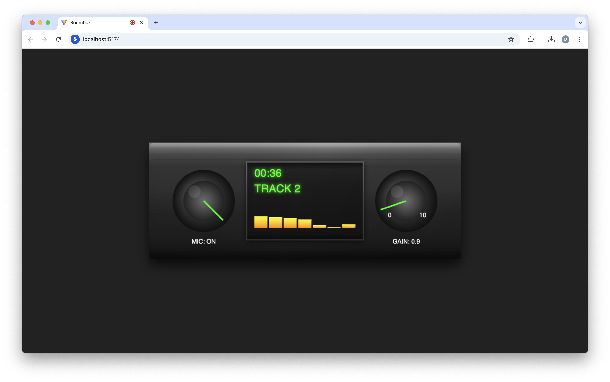

# 🎵 Boombox: Because Your Neighbors Weren't Annoyed Enough

Welcome to the most unnecessary yet oddly satisfying web-based boombox you never knew you needed! Check it out [here](https://davidyen1124.github.io/boombox/)!

## 🎪 Features That Will Blow Your Mind (Not Really)

- **Microphone Input**: Yes, we turned your expensive computer into a glorified microphone. Progress!
- **Fancy Visualizer**: Watch in amazement as colorful bars bounce up and down. It's like a disco, but for ants.
- **Gain Control**: Turn it up to 11! (Actually, only to 10 - we're not _that_ crazy)
- **Track Counter**: Counts tracks that don't exist. Peak innovation right here.
- **Random Duration Generator**: Because who needs actual music when you can have randomly generated track lengths?

_Note: No actual boomboxes were harmed in the making of this web application. Your ears, however, are on their own._

## 🎨 Technical Stuff

Built with:

- React (because everything needs to be a React app nowadays)
- Canvas API (because we hate ourselves)
- Web Audio API (for that authentic "am I actually hearing this?" experience)
- Pure determination and questionable decisions

## 📜 License

Feel free to use this however you want. We're not responsible for any existential crises that may occur while staring at the bouncing bars.

## 🙏 Acknowledgments

- Shoutout to the 80s
- Special thanks to everyone who asked "but why?"
- Dedicated to everyone who's ever carried a boombox on their shoulder
- Apologies to actual audio engineers

Remember: Just because you can build something, doesn't mean you should. But we did it anyway! 🎉
